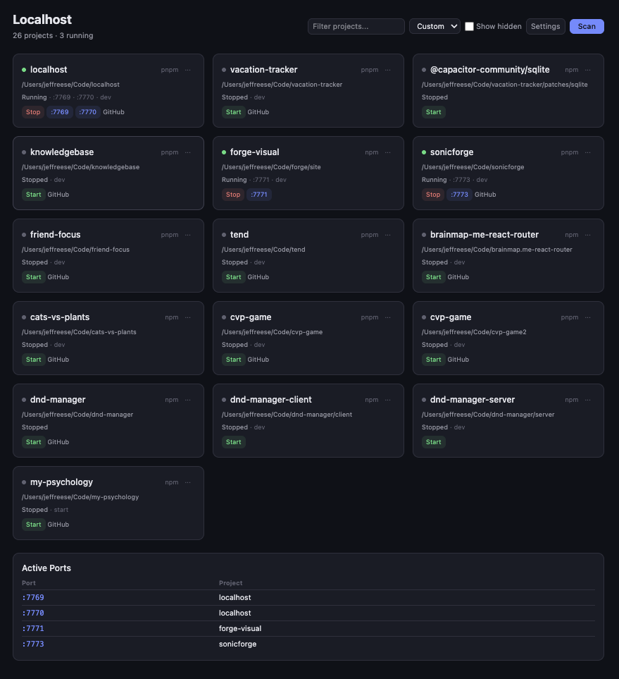

# Localhost

A local web dashboard that discovers and manages your JavaScript dev servers. Open a browser tab at `localhost:7770` and see every project in `~/Code/` — what's running, on which port, and controls to start or stop any of them.

**The problem:** Developers working across many projects inevitably lose track of which dev servers are running and which ports they're occupying. The typical workflow — `lsof -i`, `kill -9`, re-running scripts — is manual, error-prone, and interrupts focus.

**How Localhost solves it:** It continuously scans your projects directory and enumerates OS-level TCP listeners to build a real-time picture of every dev server on your machine. Detection is passive — it finds servers regardless of how they were started (terminal, IDE, background script). No configuration, no project-level setup. Just open a tab.



---

## Architecture

Localhost is a two-layer local application with no database and no external APIs.

**Backend** — Node.js + Hono, running on port 7769. Five services:

- **Scanner** — walks `~/Code/` to find npm, pnpm, and yarn projects
- **Listener Scanner** — enumerates OS TCP listeners via `lsof` and matches them to discovered projects by working directory
- **Process Manager** — spawns and kills dev server processes
- **Config Store** — persists per-project settings (preferred port, start script, etc.)
- **SSE Broadcaster** — pushes state updates to connected frontends in real time

**Frontend** — Lit web components served via Vite on port 7770. Four components backed by three reactive stores that stay in sync with the backend over SSE.

**Communication pattern:** REST for commands (start, stop, configure) flowing frontend to backend. Server-Sent Events for state updates flowing backend to frontend. This keeps the UI reactive without polling.

## Tech Stack

- **TypeScript** — throughout
- **Node.js + Hono** — backend API
- **Lit** — web components for the frontend
- **Tailwind CSS** — styling
- **Vite** — dev server and build tooling
- **Biome** — linting and formatting
- **Vitest** — testing

## Running It

```bash
pnpm install
pnpm dev
```

The dashboard will be available at [localhost:7770](http://localhost:7770). The backend API runs on port 7769.
